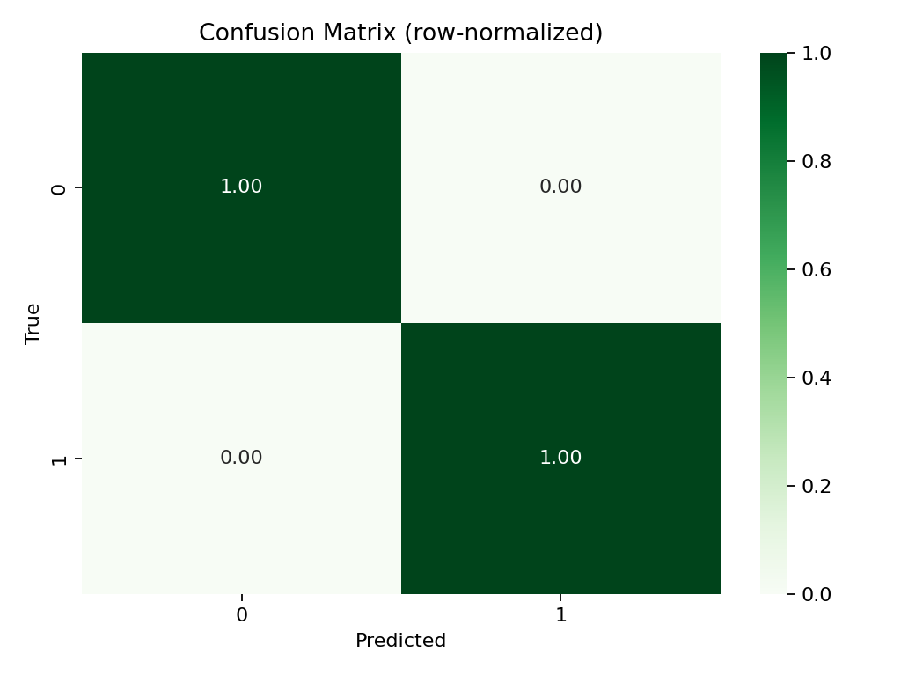

📦 ReturnRadar — E-commerce Returns Prediction (Windows/Jupyter-safe)

Predict whether an order will be returned and export reusable artifacts (HDF5, PKL, YAML, JSON) plus handy CSVs for quick inspection.

This project is wired to your files and paths:

Input CSV:
C:\Users\NXTWAVE\Downloads\Return Radar\archive\ecommerce_returns_synthetic_data.csv

Output folder:
C:\Users\NXTWAVE\Downloads\Return Radar\

It includes:

returnradar_build_v2.py — trains a model and saves artifacts

returnradar_predict.py — scores a CSV and saves predictions (+ optional metrics if ground truth exists)

✅ What’s in the dataset (columns)

Expected headers based on your file:

Order_ID, Product_ID, User_ID, Order_Date, Return_Date, Product_Category,
Product_Price, Order_Quantity, Return_Reason, Return_Status, Days_to_Return,
User_Age, User_Gender, User_Location, Payment_Method, Shipping_Method, Discount_Applied

Target derivation (binary 0/1):

Primary: Return_Status → maps “returned/yes/true/1/…” → 1, “not returned/no/false/0/…” → 0

Fallback: if needed, presence of Return_Date → 1 else 0

Rows we can’t map are dropped before training/evaluation.

Leakage avoided: Return_Date, Return_Reason, Days_to_Return are excluded from features.

🛠 Requirements (one-time)
python -m venv .venv
.\.venv\Scripts\activate
pip install -U pip
pip install pandas numpy scikit-learn pyyaml joblib tables matplotlib seaborn

tables is required for the HDF5 file.
If you use Jupyter and see IProgress/tqdm warnings, you can also pip install ipywidgets.

🚀 Train & Export Artifacts

Script: returnradar_build_v2.py (Jupyter-safe; ignores hidden -f flag)

# Activate the venv first
.\.venv\Scripts\activate

python "C:\Users\NXTWAVE\Downloads\Return Radar\returnradar_build_v2.py" `
  --data   "C:\Users\NXTWAVE\Downloads\Return Radar\archive\ecommerce_returns_synthetic_data.csv" `
  --outdir "C:\Users\NXTWAVE\Downloads\Return Radar"

What you’ll get in the output folder:

processed_returns.h5 — holdout predictions table (HDF5; key=holdout)

returns_model.pkl — trained scikit-learn Pipeline (OneHot + LogisticRegression, class-balanced)

build_metadata.yaml — schema, selected columns, metrics summary

insights.json — overall return rate, AUC, top positive features, and return-rate by category/payment/shipping/location (if present)

eval_report.csv — classification_report for the holdout

confusion_matrix.csv — 2×2 matrix with labels [0,1]

🔮 Predict & Save Results

Script: returnradar_predict.py (Jupyter-safe)

python "C:\Users\NXTWAVE\Downloads\Return Radar\returnradar_predict.py" `
  --model  "C:\Users\NXTWAVE\Downloads\Return Radar\returns_model.pkl" `
  --data   "C:\Users\NXTWAVE\Downloads\Return Radar\archive\ecommerce_returns_synthetic_data.csv" `
  --outdir "C:\Users\NXTWAVE\Downloads\Return Radar"

Outputs:

predictions_ecommerce_returns_synthetic_data.csv
(original columns + proba_return + returned_pred)

If ground truth can be derived from your CSV:

prediction_report_ecommerce_returns_synthetic_data.csv

confusion_matrix_pred.csv

The predictor mirrors training preprocessing:

Parses Order_Date → (Order_Year, Order_Month, Order_DOW, Order_Hour)

Drops leakage columns and ID/target-like fields

📊 Show & Save Accuracy Graph + Heatmaps (optional)

If you already trained:

# Jupyter cell: saves plots into C:\Users\NXTWAVE\Downloads\Return Radar
from pathlib import Path
import numpy as np, pandas as pd, matplotlib.pyplot as plt, seaborn as sns

OUT = Path(r"C:\Users\NXTWAVE\Downloads\Return Radar")
rep_csv = OUT/"eval_report.csv"
cm_csv  = OUT/"confusion_matrix.csv"

rep = pd.read_csv(rep_csv, index_col=0)
cm  = pd.read_csv(cm_csv, index_col=0).values
acc = float(rep.loc["accuracy","0"]) if "accuracy" in rep.index else 0.0

plt.figure(); ax = sns.barplot(x=["accuracy"], y=[acc]); ax.set_ylim(0,1); ax.set_title("Model Accuracy")
for c in ax.containers: ax.bar_label(c, fmt="%.3f")
plt.tight_layout(); plt.savefig(OUT/"viz_accuracy.png", dpi=160); plt.show()

plt.figure(); sns.heatmap(cm, annot=True, fmt="d", cmap="Blues", xticklabels=["0","1"], yticklabels=["0","1"])
plt.xlabel("Predicted"); plt.ylabel("True"); plt.title("Confusion Matrix (counts)")
plt.tight_layout(); plt.savefig(OUT/"viz_confusion_matrix.png", dpi=160); plt.show()

row_sums = cm.sum(axis=1, keepdims=True); norm = cm/np.where(row_sums==0,1,row_sums)
plt.figure(); sns.heatmap(norm, annot=True, fmt=".2f", cmap="Greens", xticklabels=["0","1"], yticklabels=["0","1"])
plt.xlabel("Predicted"); plt.ylabel("True"); plt.title("Confusion Matrix (row-normalized)")
plt.tight_layout(); plt.savefig(OUT/"viz_confusion_matrix_normalized.png", dpi=160); plt.show()

🧠 Model details

Features: mix of numeric/categorical from your CSV
(ColumnTransformer: SimpleImputer → StandardScaler for numeric, OneHotEncoder for categorical)

Classifier: LogisticRegression(C=4.0, max_iter=500, class_weight='balanced', solver='lbfgs')

Sklearn compatibility: the scripts use a version-adaptive OneHot encoder
(≥1.2: sparse_output=False; older: sparse=False)

🧰 Project layout (suggested)
Return Radar/
├─ archive/
│  └─ ecommerce_returns_synthetic_data.csv
├─ returnradar_build_v2.py
├─ returnradar_predict.py
├─ returns_model.pkl
├─ processed_returns.h5
├─ build_metadata.yaml
├─ insights.json
├─ eval_report.csv
├─ confusion_matrix.csv
└─ viz_*.png  (optional visuals)

🛠 Troubleshooting

“Model not found” when predicting
→ Run the training script first to create returns_model.pkl.

HDF5 write error
→ pip install tables (then re-run training).

OneHotEncoder sparse argument error
→ You’re on sklearn ≥1.2. The provided scripts already handle this; use the latest code.

Argparse error in Jupyter (-f kernel.json)
→ Scripts use parse_known_args so they’re Jupyter-safe.

🔄 Next ideas

Export ROC and PR curves, and a per-feature importance chart

Quick Gradio UI to paste/edit an order row and see proba_return live

Add LightGBM/XGBoost for stronger baselines

Ship a FastAPI endpoint for real-time scoring
AUTHOR
SAGNIK PATRA
